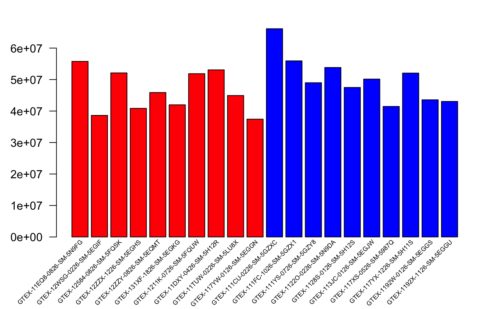
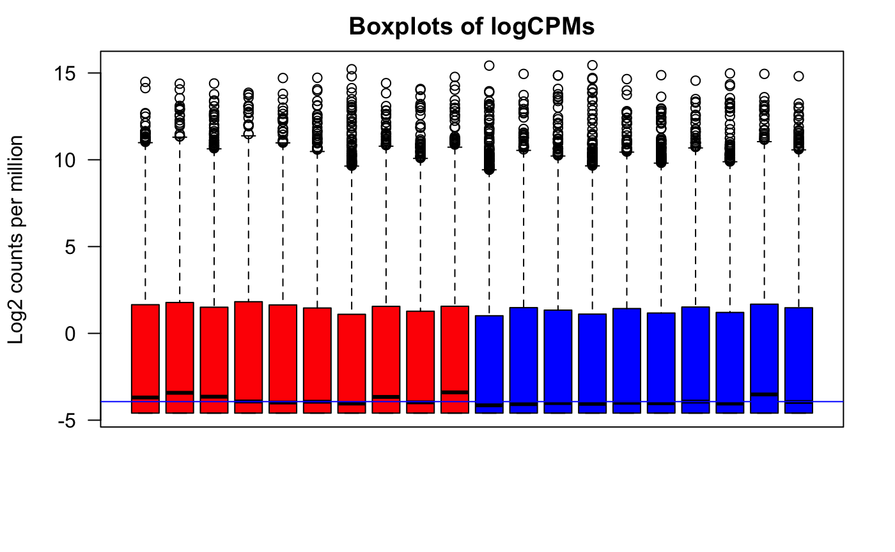
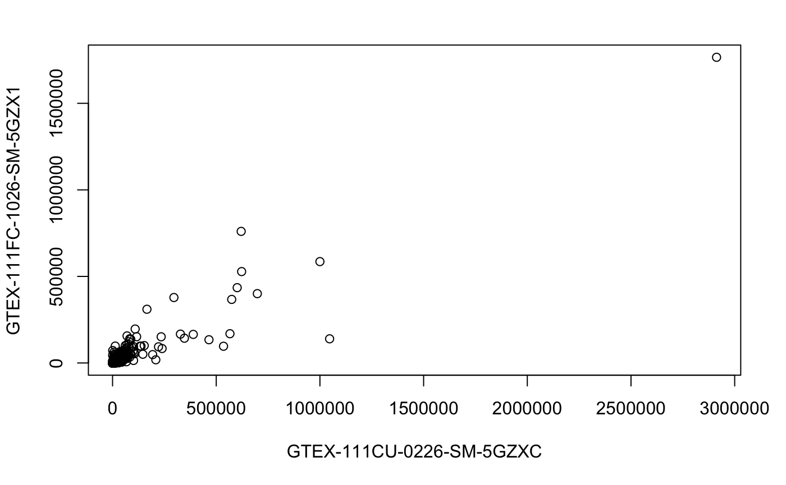
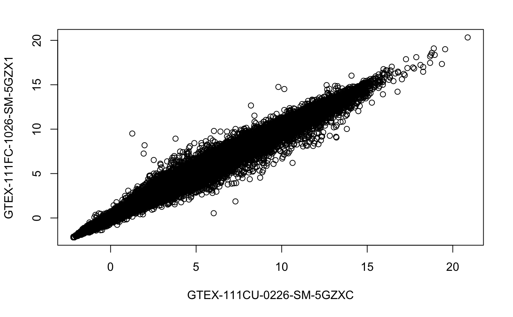
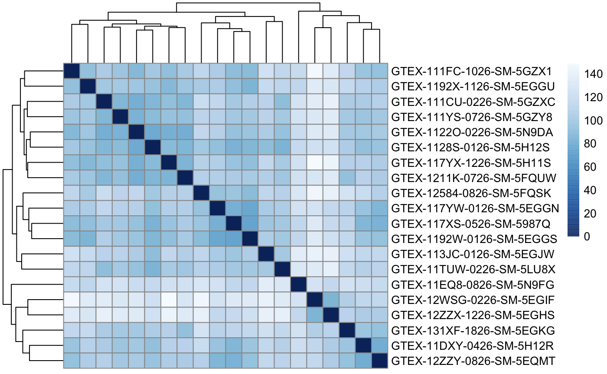

\newpage
# Introducción y objetivos

Las nuevas técnicas de ultra secuenciación, también conocidas cómo next-generation sequencing (NGS) [han revolucionado la práctica clínica](http://www.ncbi.nlm.nih.gov/pubmed/21478889).

Las técnicas de NGS permiten obtener de forma barata y rápida la secuencias de ADN completas a partir de muestras de organismos vivos. En el caso de los humanos, aproximadamente el 1-2% del ADN
se utiliza para generar proteínas (exomas) y [hay estudios que sugieren](https://pubmed.ncbi.nlm.nih.gov/21730106/) que la causa de muchas enfermedades genéticas afecta específicamente a los exones.

Por todo esto en este trabajo se analizarán muestras de ultrasecuenciación procedentes de un estudio que utiliza NGS presente en [la web de GTEx](https://www.gtexportal.org/home/) pertenecientes a un análisis del tiroides en donde se compara tres tipos de infiltración medido en un total de 292 muestras pertenecientes a tres grupos:

- Not infiltrated tissues (NIT): 236 samples
- Small focal infiltrates (SFI): 42 samples
- Extensive lymphoid infiltrates (ELI): 14 samples.

Por motivos didácticos y de eficiencia computacional se ha reducido el número de muestras a 10 por grupo escogidas aleatoriamente.

A partir de estas muestras previamente clasificadas se intentará listar que genes presentan diferencias estadísticamente significativas en sus niveles de expresión.

# Materiales y Métodos

A continuación se resume el flujo de trabajo seguido en el análisis, este trabajo ha sido realizado utilizando R y R-Studio y todo el código y datos está disponible en un repositorio de GitHub de forma que los resultados sean fácilmente reproducibles y cualquier paso puede verse en detalle.

\newpage

## Muestreo aleatorio simple de los datos

Para crear el conjunto incial de datos se realizó un muestreo aleatorio simple eligiendo 10 muestras correspondientes a cada grupo (NIT) (SFI) (ELI).

## Análisis inicial

Una vez elegidas las muestras se realizó un análisis visual sobre los datos en crudo y log2 de CPM para buscar posibles anomalías. El color rojo representa ELI y el azul NIT.

{ width=50% }
{ width=50% }

## Filtrado y normalización

De los 56202 genes iniciales, se realiza un filtrado sencillo descartando aquellos que no se expresan quedando como resultado 40742 muestras. Sobre estas muestras se aplica [el algoritmo rlog](https://genomebiology.biomedcentral.com/articles/10.1186/s13059-014-0550-8) dado que [el tamaño de la muestra es pequeño](https://www.ncbi.nlm.nih.gov/pmc/articles/PMC3885686/).

A continuación se presenta un ejemplo del efecto de la transformación en una muestras. A la izquierda los datos en crudo y a la derecha los normalizados mediante rlog.

{ width=50% }
{ width=50% }

## Heatmap

## Análisis de expresión diferencial

Se utiliza bioconductor con las funciones `DESeqDataSetFromMatrix` y [DESeq](https://genomebiology.biomedcentral.com/articles/10.1186/s13059-014-0550-8) para crear una lista de genes cuya expresión es diferente entre los grupos.

De entre todos ellos seleccionamos los más relevantes de acuerdo a su pvalor y los añadimos la columna SYMBOL derivada de los ENSEMBL IDs para facilitar la interpretación biológica
de los resultados.

## Resultados

La siguiente tabla muestra los genes que han diferenciado sus niveles de expresión entre grupos de una forma estadísticamete significativa:

| log2FoldChange|     lfcSE|     stat|    pvalue|      padj|symbol   |
|:---------------|---------:|--------------:|---------:|--------:|---------:|---------:|:--------|
| 2.412671| 0.5297461| 4.554392| 0.0000053| 0.0009312|TNFRSF18 |
| 3.936202| 0.6254408| 6.293484| 0.0000000| 0.0000002|AMPD1    |
| 3.783565| 0.7912021| 4.782046| 0.0000017| 0.0003530|TTC24    |
| 5.708194| 0.6624761| 8.616453| 0.0000000| 0.0000000|FCRL5    |
| 4.869907| 0.9200411| 5.293141| 0.0000001| 0.0000313|FCRL2    |
| 3.881095| 0.6107648| 6.354484| 0.0000000| 0.0000001|SLAMF7   |

# Discusión

- Sería interesante contrastar los resultados con un biólogo para realizar una interpretación biológica completa.
- Existen muchas aproximaciones a este problema quizá estaría bien mezclar varias y buscar genes identificados por la mayoría.
- El creador de Dseq propone un [paso final de normalización](https://www.bioconductor.org/packages/devel/workflows/vignettes/rnaseqGene/inst/doc/rnaseqGene.html) que no se ha realizado en este estudio.
- [La universidad de Cambridge](https://bioinformatics-core-shared-training.github.io/RNAseq-R/) propone una aproximación basada en modelos lineales que parece más sencilla de comprender.

# Apéndice

- [Código en github]()
- Todas las referencias del texto son link al artículo original. [(Hypercitation)](https://slate.com/technology/2014/02/citing-with-hyperlinks-academia-will-change-with-hypercitation.html)